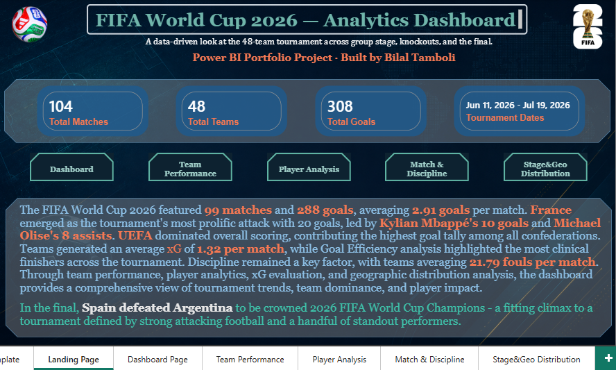
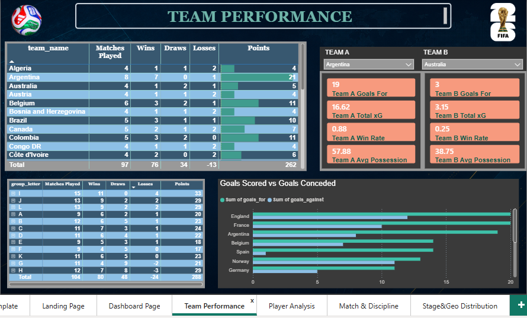
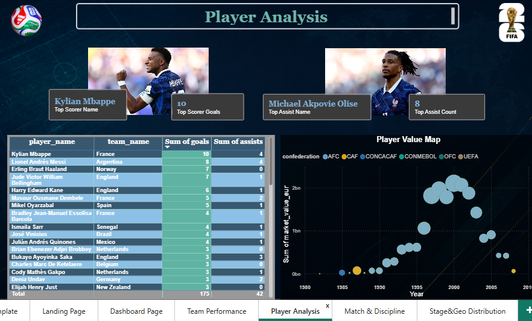
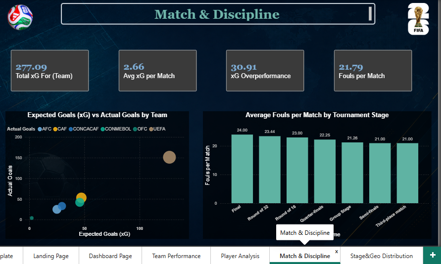
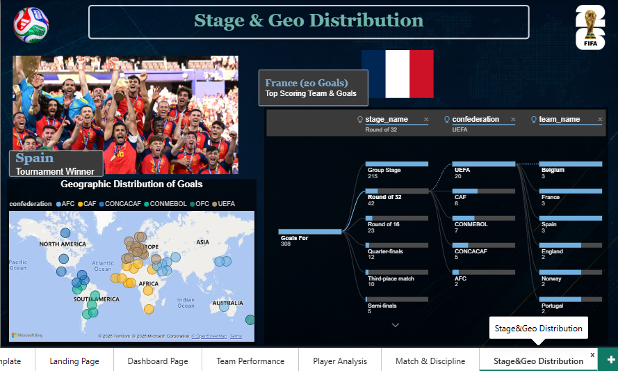

<p align="center">
  
</p>

# 🏆 FIFA World Cup 2026 — Power BI Analytics

<p align="center">
  
</p>

<p align="center">
  
  
  
  
</p>

An end-to-end Power BI portfolio project built on the [FIFA World Cup 2026 Dataset](https://www.kaggle.com/datasets/mominullptr/fifa-world-cup-2026-dataset) — covering the full 48-team tournament from group stage through the Final, with a 9-table relational data model, custom DAX measures, and a 6-page interactive report.

---

## 📊 What's Inside

| Page | What it shows |
|---|---|
| **Home / Landing** | Tournament overview, live KPI cards, navigation, project summary |
| **Dashboard** | Tournament-wide KPIs — total goals, matches, shot accuracy, goals by confederation, top-scoring teams |
| **Team Performance** | Standings, group-stage breakdown, Goals For/Against, head-to-head team comparison tool |
| **Player Analysis** | Top scorers & assists, minutes played, an Age vs. Market Value vs. Goals bubble map |
| **Match & Discipline** | Expected Goals (xG) vs. actual goals per team, fouls-per-match trend across tournament stages |
| **Stage and Geo Distribution** | Decomposition Tree — drill into what's driving tournament goals by confederation, stage, and team |

---

## 📸 Screenshots

### Home / Landing


### Dashboard


### Team Performance


### Player Analysis


### Match & Discipline


### Stage and Geo Distribution


---

## 🥅 Key Insights

> The tournament produced a high-scoring, competitive 48-team field with output concentrated among a handful of standout sides. Expected-goals analysis surfaced clear over- and under-performers relative to their underlying chance quality, and match intensity (fouls per match) increased as the competition moved from the group stage into the knockout rounds — consistent with the rising stakes of elimination football.
>
> **Spain defeated Argentina in the Final** to be crowned 2026 FIFA World Cup Champions.

---

## 🗂️ Data Model

- **9 relational tables**: `teams`, `venues`, `tournament_stages`, `matches`, `squads_and_players`, `match_events`, `match_team_stats`, `match_lineups`, `player_stats`
- A custom **team-match bridge table** (`match_team_bridge`) built in Power Query to resolve the home/away dual-relationship problem between `matches` and `teams`, and to enable clean team-level filtering across the whole report.
- A dedicated **Date table** for time-intelligence and continuous-axis charting.
- Two independent, **disconnected selector tables** paired with `TREATAS` to power the Team A vs. Team B head-to-head comparison tool.

## 🧮 DAX Highlights

A few of the more interesting measures from the build:

```DAX
-- Dynamic tournament winner, pulled from the most recent match
Tournament Winner = 
VAR LastMatchDate = MAX(matches[date])
VAR LastMatch = FILTER(ALL(matches), matches[date] = LastMatchDate)
VAR HomeScore = MAXX(LastMatch, matches[home_score])
VAR AwayScore = MAXX(LastMatch, matches[away_score])
VAR HomeTeamID = MAXX(LastMatch, matches[home_team_id])
VAR AwayTeamID = MAXX(LastMatch, matches[away_team_id])
VAR WinnerIDText = IF(HomeScore > AwayScore, FORMAT(HomeTeamID, "0"), FORMAT(AwayTeamID, "0"))
VAR WinnerTeam = 
    MAXX(FILTER(ALL(teams), FORMAT(teams[team_id], "0") = WinnerIDText), teams[team_name])
RETURN WinnerTeam

-- Expected-goals overperformance, per team
xG Overperformance = [Goals For] - SUM(match_team_bridge[xg_for])

-- Head-to-head comparison via disconnected selector tables
Team A Goals For = 
CALCULATE([Goals For], TREATAS(VALUES('Team A Selector'[team_name]), teams[team_name]))
```

## 🛠️ Challenges & What I Learned

- Diagnosed and fixed a **relationship fan-out bug** where `match_team_stats` was incorrectly related directly to `teams` instead of via a composite key to the bridge table — traced with step-by-step `DISTINCTCOUNT` isolation rather than guesswork, since numbers only broke when a specific dimension (Stage) was used as a filter.
- Handled a **home/away dual-relationship problem** (Power BI only allows one active relationship between a pair of tables) by building a dedicated team-match bridge table instead of relying solely on `USERELATIONSHIP`.
- Built **independent, disconnected slicers** for side-by-side team comparison using `TREATAS`, since a single slicer on `teams[team_name]` can't drive two separate selections on the same page.
- Iterated on visual density — several page ideas were deliberately trimmed or replaced (tables swapped for a single scatter/bubble chart, a planned referee-based chart replaced with a stage-based one) once real space and real data constraints emerged.

## 🎨 Design

Dark navy/teal theme with gold accent, built to feel like a broadcast-graphics package rather than a generic BI template:

| | Hex |
|---|---|
| Background base | `#0a1628` / `#0c2b2e` |
| Primary accent (teal) | `#5fb3a3` |
| Secondary accent (gold) | `#c9a227` |

## 📁 Files in this Repo

```
analytics_dashboard_fifawc26/
├── FIFA_WC2026_Dashboard.pbix     # Main Power BI report
├── assets/
│   ├── banner.png
│   └── screenshots/
│       ├── logo2026.png
│       ├── LandingPage.png
│       ├── TournamentDashboard - 2026.png
│       ├── TeamPerformance.png
│       ├── PlayerAnalysis.png
│       ├── MatchDiscipline.png
│       └── StageGeoDistribution.png
└── README.md
```

## 🚀 How to View

1. Download `FIFA_WC2026_Dashboard.pbix`.
2. Open in [Power BI Desktop](https://www.microsoft.com/en-us/power-platform/products/power-bi/desktop) (free).
3. Data connections point to local CSV files — if you want to explore the raw data yourself, grab it from the [original Kaggle dataset](https://www.kaggle.com/datasets/mominullptr/fifa-world-cup-2026-dataset).

## 📌 Data Source

[FIFA World Cup 2026 Dataset](https://www.kaggle.com/datasets/mominullptr/fifa-world-cup-2026-dataset) by mominullptr on Kaggle.

---

<p align="center">
<b>Bilal Tamboli</b><br>
Created as a personal data analytics portfolio project.<br>
© 2026 Bilal Tamboli. All rights reserved.
</p>
